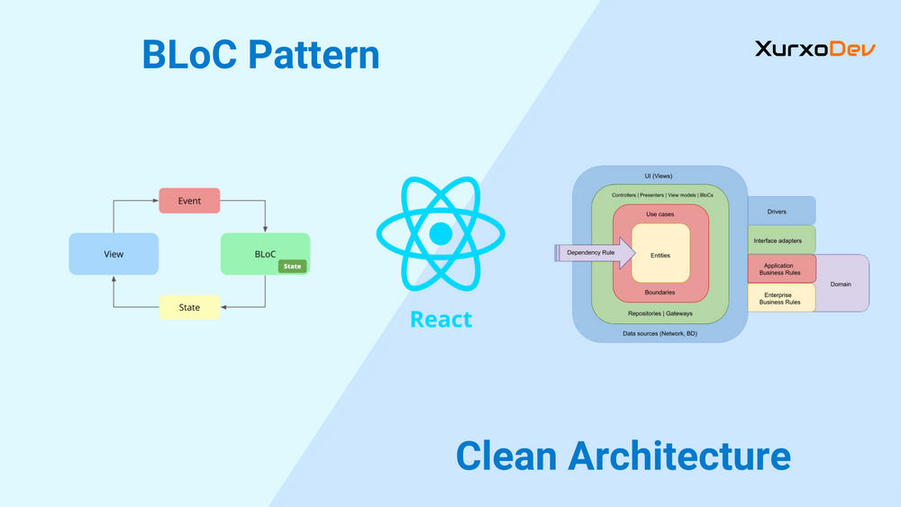

# TaskManager App - Gerenciador de Tarefas

## Desafio Parte 1 

1) ○ Como você geralmente se mantém atualizado com novas tecnologias? Cite
fontes ou métodos que utiliza, como YouTube, cursos online ou a
documentação oficial. 

R: Eu sempre procuro me atualizar vendo as documentações, buscando no youtuber (como o filepe deChamps, Diego Fernandes) e rede sociais. Também por cursos na udemy, Rocketseat. Sempre estudando e ou fazendo algum projeto para fixar o conhecimento.

2) No React, o uso de function e arrow function gera discussões entre
os desenvolvedores. Qual a sua opinião sobre as duas abordagens?
(Explique com exemplos práticos onde cada uma poderia ser mais
vantajosa.)

R: Eu acho as duas abordagens validas. E que vai de caso a caso, eu gosto de usar a arrow function para programação funcional  pois eu sei que o **this** da arrow function vai sempre se o mesmo contexto da função criada. Enquanto para um função mais tradicional o contexto do **this** pode mudar.  Em suma, as funções tradicionais são mais recomendas para componentes de classe e exigem uma compatibilidade com códigos mais antigos do javascript, enquanto as arrow functions são para componentes funcionais onde a sintaxe é mais fácil de se ler.

3) ○ Relate uma situação desafiadora que enfrentou no desenvolvimento de um
app. Pode ser um bug complexo ou a implementação de uma funcionalidade
crítica. Como lidou com isso? Qual foi o resultado?

R: Eu acho que foi preciso implementar testes E2E e teste unitarios usando a ferramenta do Cypress.js. Pois no app da Flipper, usávamos uma arquitetura chamada BLoC Parttenes, ela é comumente usado no Flutter, e nos adaptamos essa arquitetura no React, o mais desafio foi instanciar o Provider para que os teste pudessem rodar. Como era algo novo e eu nunca tinha feito, precisei me importar tambem para os testes assim, ele conseguir achar o contexto.

4) Dê um exemplo de problema resolvido usando Context API e Hooks no
React Native. Descreva o problema, sua solução e o impacto.

R: Eu vez precisei usar o Chart.js para criar gráficos de aplicações financeiras em dashboard . E como esses dados precisavam estar de uma maneira global pois eles vinham de vários Players (BTG Pactual, Agora, Xp investimentos, RICO etc…) Assim esse dados ficam disponíveis para todo o app evitam a duplicação de código, e melhor eficiência na atualização dos estados.

5) Explique como configuraria o roteamento entre páginas em um aplicativo
React Native. Cite as bibliotecas que utilizaria e por quê.

R: Bem para configurar o roteamento de paginas eu uso o **React Navigation** e o **React Native Navigation**, que é o mais popular e recomentados. Eu começaria primeiro pela instalação do pacote.

Depois eu crio um arquivo **navigation.js** com o seguinte código:

Este é um aplicativo de gerenciamento de tarefas construído com **React Native** e utilizando o padrão **BLoC (Business Logic Component)** para gerenciar o estado. O app permite ao usuário adicionar, listar, e marcar tarefas como concluídas.

```bash
import React from 'react';
import { createStackNavigator } from '@react-navigation/stack';
import { NavigationContainer } from '@react-navigation/native';
import TaskListScreen from '../screens/TaskListScreen';
import AddTaskScreen from '../screens/AddTaskScreen';

const Stack = createStackNavigator();

const AppNavigator = () => {
  return (
    <NavigationContainer>
      <Stack.Navigator initialRouteName="TaskList"
        screenOptions={{
            headerStyle: { backgroundColor: '#6a1b9a' }, 
            headerTintColor: '#fff', 
            headerTitleAlign: 'center', 
            headerTitleStyle: { fontWeight: 'bold' },
          }}>
        <Stack.Screen name="TaskList" options={{ headerTitle: 'Lista de Tarefas' }} component={TaskListScreen} />
        <Stack.Screen name="AddTask" options={{ headerTitle: 'Adicionar de Tarefas' }} component={AddTaskScreen} />
      </Stack.Navigator>
    </NavigationContainer>
  );
};
```
Em seguida eu chamo no app.js, já com as screen e componentes criados: 

```bash
import React from 'react';
import { TaskProvider } from '../src/bloc/taskBloc';
import AppNavigator from '../src/navigation/AppNavigator';

const App = () => {
  return (
      <TaskProvider>
        <AppNavigator />
      </TaskProvider>
  );
};

export default App;
```

## Desafio Parte 2

<div style="display: flex; justify-content: space-between;">
  
  
</div>

## Funcionalidades

- **Listar Tarefas**: Exibe uma lista de tarefas e permite marcar como concluídas.
- **Adicionar Tarefa**: Permite adicionar uma nova tarefa ao aplicativo.
- **Alterar Status de Tarefa**: O usuário pode marcar a tarefa como concluída ou pendente.
- **Limpar Concluídas**: Permite limpar todas as tarefas concluídas.
- **Persistência de Dados**: Os dados das tarefas são salvos localmente utilizando **AsyncStorage**.

## Tecnologias Utilizadas

- **React Native**: Para o desenvolvimento do aplicativo móvel.
- **React Navigation**: Para navegação entre telas.
- **Context API**: Para gerenciar o estado global das tarefas.
- **AsyncStorage**: Para persistir as tarefas localmente no dispositivo.
- **Material Design**: Para a criação de componentes com um design moderno e consistente.

## Por que Usamos o Padrão BLoC?



O **BLoC (Business Logic Component)** é um padrão de arquitetura que ajuda a separar a lógica de negócios da interface do usuário. Esse padrão é muito útil em aplicativos que exigem um gerenciamento eficiente do estado, pois promove a reutilização de código, facilita os testes e melhora a manutenibilidade do projeto.

### Benefícios do BLoC no nosso aplicativo:
- **Separação clara de responsabilidades**: O **BLoC** ajuda a separar a lógica de negócios da interface do usuário, tornando o código mais limpo e fácil de entender. No nosso caso, isso facilita o gerenciamento das tarefas, como a criação, a alteração de status e a remoção de tarefas.
- **Reatividade**: O padrão BLoC faz uso de streams e blocos de dados, permitindo que a interface do usuário seja automaticamente atualizada quando o estado das tarefas mudar. Isso significa que, ao adicionar ou alterar tarefas, a interface do usuário reflete as mudanças imediatamente sem a necessidade de ações manuais de atualização.
- **Testabilidade**: A separação da lógica de negócios do código da UI facilita a escrita de testes unitários para o **BLoC**. Isso melhora a qualidade do código, pois podemos testar cada parte de forma independente.
- **Escalabilidade**: O uso do **BLoC** facilita a manutenção e a adição de novas funcionalidades no futuro. A arquitetura modular e desacoplada torna o código mais fácil de escalar, já que a lógica de negócios pode ser alterada sem afetar a interface do usuário.

Ao usar o **BLoC**, conseguimos garantir que o gerenciamento do estado seja robusto, previsível e fácil de testar. Essa escolha de arquitetura se alinha com as melhores práticas no desenvolvimento de aplicativos React Native, onde a separação de responsabilidades é crucial para manter o código organizado e fácil de gerenciar.

## Como Rodar o Projeto

### Pré-requisitos

Antes de começar, você precisa ter o **Node.js** e o **Expo CLI** instalados na sua máquina.

1. Instale o **Node.js** [aqui](https://nodejs.org/).
2. Instale o **Expo CLI** globalmente:
   
   ```bash
   npm install -g expo-cli

## Passo a Passo

### 1. Clone o repositório:

```bash
git clone https://github.com/usuario/taskmanager-app.git
cd taskmanager-app
```

### 2. Instale as dependências:
No diretório do projeto, rode o comando abaixo para instalar todas as dependências do projeto:

```bash
npm install
```

### 3. Inicie o projeto:
Para rodar o aplicativo no seu dispositivo ou no emulador, utilize o Expo:

```bash
expo start
```

Isso abrirá o Expo DevTools no seu navegador e você poderá escanear o QR code com o Expo Go no seu dispositivo ou executar no emulador.


