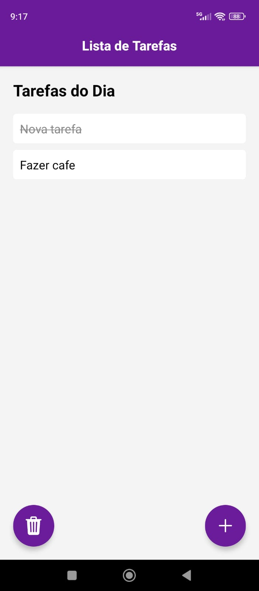

# TaskManager App - Gerenciador de Tarefas

Este é um aplicativo de gerenciamento de tarefas construído com **React Native** e utilizando o padrão **BLoC (Business Logic Component)** para gerenciar o estado. O app permite ao usuário adicionar, listar, e marcar tarefas como concluídas.


<div style="display: flex; justify-content: space-between;">
  
  
</div>


## Funcionalidades

- **Listar Tarefas**: Exibe uma lista de tarefas e permite marcar como concluídas.
- **Adicionar Tarefa**: Permite adicionar uma nova tarefa ao aplicativo.
- **Alterar Status de Tarefa**: O usuário pode marcar a tarefa como concluída ou pendente.
- **Limpar Concluídas**: Permite limpar todas as tarefas concluídas.
- **Persistência de Dados**: Os dados das tarefas são salvos localmente utilizando **AsyncStorage**.

## Tecnologias Utilizadas

- **React Native**: Para o desenvolvimento do aplicativo móvel.
- **React Navigation**: Para navegação entre telas.
- **Context API**: Para gerenciar o estado global das tarefas.
- **AsyncStorage**: Para persistir as tarefas localmente no dispositivo.
- **Material Design**: Para a criação de componentes com um design moderno e consistente.

## Por que Usamos o Padrão BLoC?

O **BLoC (Business Logic Component)** é um padrão de arquitetura que ajuda a separar a lógica de negócios da interface do usuário. Esse padrão é muito útil em aplicativos que exigem um gerenciamento eficiente do estado, pois promove a reutilização de código, facilita os testes e melhora a manutenibilidade do projeto.

### Benefícios do BLoC no nosso aplicativo:
- **Separação clara de responsabilidades**: O **BLoC** ajuda a separar a lógica de negócios da interface do usuário, tornando o código mais limpo e fácil de entender. No nosso caso, isso facilita o gerenciamento das tarefas, como a criação, a alteração de status e a remoção de tarefas.
- **Reatividade**: O padrão BLoC faz uso de streams e blocos de dados, permitindo que a interface do usuário seja automaticamente atualizada quando o estado das tarefas mudar. Isso significa que, ao adicionar ou alterar tarefas, a interface do usuário reflete as mudanças imediatamente sem a necessidade de ações manuais de atualização.
- **Testabilidade**: A separação da lógica de negócios do código da UI facilita a escrita de testes unitários para o **BLoC**. Isso melhora a qualidade do código, pois podemos testar cada parte de forma independente.
- **Escalabilidade**: O uso do **BLoC** facilita a manutenção e a adição de novas funcionalidades no futuro. A arquitetura modular e desacoplada torna o código mais fácil de escalar, já que a lógica de negócios pode ser alterada sem afetar a interface do usuário.

Ao usar o **BLoC**, conseguimos garantir que o gerenciamento do estado seja robusto, previsível e fácil de testar. Essa escolha de arquitetura se alinha com as melhores práticas no desenvolvimento de aplicativos React Native, onde a separação de responsabilidades é crucial para manter o código organizado e fácil de gerenciar.

## Como Rodar o Projeto

### Pré-requisitos

Antes de começar, você precisa ter o **Node.js** e o **Expo CLI** instalados na sua máquina.

1. Instale o **Node.js** [aqui](https://nodejs.org/).
2. Instale o **Expo CLI** globalmente:
   
   ```bash
   npm install -g expo-cli

## Passo a Passo

### 1. Clone o repositório:

```bash
git clone https://github.com/usuario/taskmanager-app.git
cd taskmanager-app
```

### 2. Instale as dependências:
No diretório do projeto, rode o comando abaixo para instalar todas as dependências do projeto:

```bash
npm install
```

### 3. Inicie o projeto:
Para rodar o aplicativo no seu dispositivo ou no emulador, utilize o Expo:

```bash
expo start
```

Isso abrirá o Expo DevTools no seu navegador e você poderá escanear o QR code com o Expo Go no seu dispositivo ou executar no emulador.


